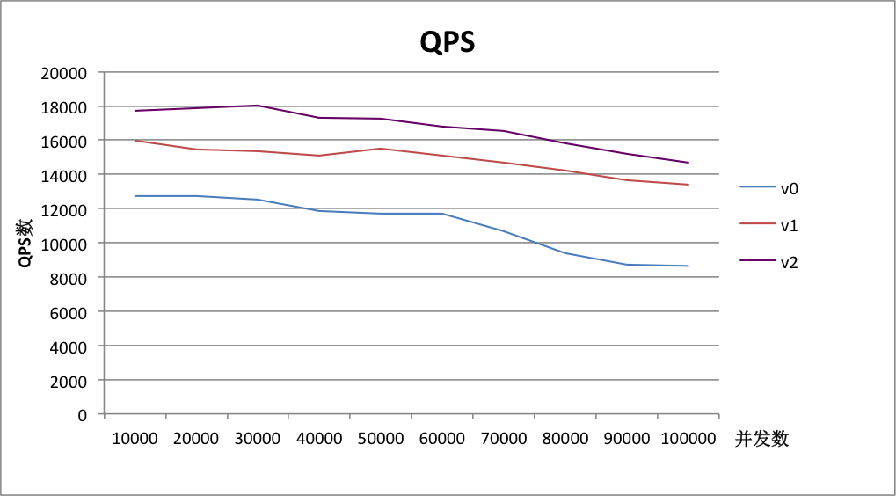
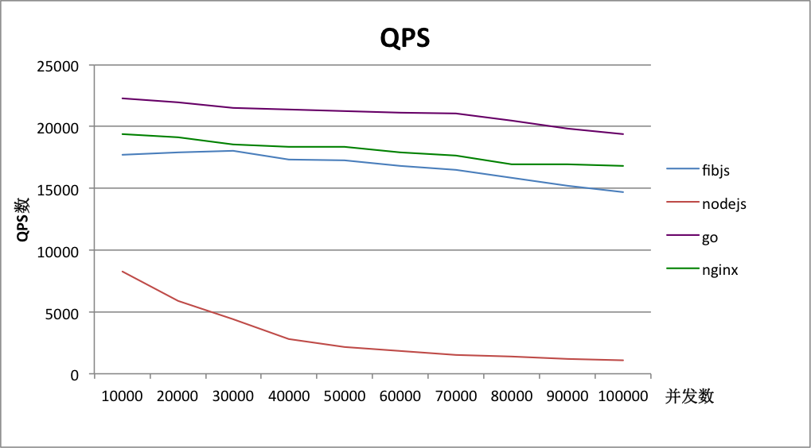

## 测试内容

动态HTTP服务器极限性能，分为两项：

* 优化前后的各版本fibjs
* 优化后的fibjs、使用cluster的nodejs、基于模块的nginx、使用多核的go

### 测试环境及方法
服务器
> CPU：8核（4sockets*2cores），每核2.1GHz <br/>
> 内存：24GB

客户端（10个）
> CPU：1核，每核2.1GHz <br/>
> 内存：1GB

测试流程：

1. 首先在服务器端开启server
2. 调度机ssh到客户端触发对服务器的wrk请求（测试时长为30min）
3. 测试的并发量从1w~10w，递增幅度为1w


### 测试项一：fibjs优化前后性能对比
3个版本的fibjs，分别为：

1. v0: 原版fibjs
2. v1: 优化了SOCKET_ BUFF_ SIZE大小
3. v2: socket 等待时释放 buffer 内存

#### 测试结果

QPS（req/sec）

\      |   v0  |   v2  |  v3 |
------ | ----- | ----- | -----
10000  | 12750 | 15971 | 17705
20000  | 12757 | 15480 | 17893
30000  | 12551 | 15362 | 18045
40000  | 11858 | 15087 | 17326
50000  | 11678 | 15503 | 17237
60000  | 11708 | 15093 | 16800
70000  | 10682 | 14674 | 16513
80000  | 9395  | 14223 | 15840
90000  | 8733  | 13681 | 15209
100000 | 8645  | 13375 | 14664

QPS曲线如下图：



内存占用（单位GB）

\      |   v0  |  v1  |  v2  |
------ | ----- | ---- | ----
10000  | 1.55  | 0.37 | 0.14
20000  | 2.95  | 0.68 | 0.22
30000  | 4.32  | 1.05 | 0.27
40000  | 5.82  | 1.32 | 0.35
50000  | 7.27  | 1.63 | 0.41
60000  | 8.79  | 1.89 | 0.47
70000  | 10.15 | 2.32 | 0.53
80000  | 11.57 | 2.63 | 0.6
90000  | 13.03 | 2.98 | 0.67
100000 | 14.5  | 3.36 | 0.79

内存占用曲线如下图：


### 测试项二：优化后的fibjs与其他服务器性能对比
服务器分别为：

1. 优化后的fibjs			(v0.1.7)
2. 使用了cluster的nodejs	(v0.10.25)
3. 使用多核的go			(v1.5.1)
4. nginx模块				(v1.9.2)

#### 测试结果

QPS（req/sec）

\      | fibjs |nodejs|   go  | nginx |
------ | ----- | ----- | ----- | ------
10000  | 17705 | 8268 | 22284 | 19393
20000  | 17893 | 5866 | 21975 | 19096
30000  | 18045 | 4412 | 21531 | 18521
40000  | 17326 | 2817 | 21362 | 18331
50000  | 17237 | 2179 | 21277 | 18328
60000  | 16800 | 1853 | 21113 | 17936
70000  | 16513 | 1536 | 21029 | 17644
80000  | 15840 | 1385 | 20497 | 16973
90000  | 15209 | 1232 | 19843 | 16966
100000 | 14664 | 1089 | 19386 | 16805

QPS曲线如下图



内存占用（单位GB）

\      |fibjs |nodejs|  go  | nginx |
------ | ---- | ---- | ---- | ----
10000  | 0.14 | 0.56 | 0.37 | 0.1
20000  | 0.22 | 0.68 | 0.68 | 0.1
30000  | 0.27 | 0.76 | 1.05 | 0.11
40000  | 0.35 | 0.84 | 1.32 | 0.12
50000  | 0.41 | 0.92 | 1.63 | 0.12
60000  | 0.47 | 1.02 | 1.89 | 0.12
70000  | 0.53 | 1.08 | 2.32 | 0.13
80000  | 0.6  | 1.14 | 2.63 | 0.13
90000  | 0.67 | 1.3  | 2.98 | 0.14
100000 | 0.79 | 1.45 | 3.36 | 0.14

内存占用曲线如下图


服务器CPU占用情况

\        |  fibjs  |   nodejs  |    go   |   nginx  |
-------- | ------- | --------- | ------- | ---------
CPU占用率 | 500~600 | (90~98)*8 | 200~400 | (30~35)*8

### 结论

模型

* fibjs和go均为单进程多线程 <br/>
* nodejs(cluster)和nginx是多进程

内存占用

* go平均每个请求所需内存最多，约为320KB
* fibjs和nodejs平均每个请求所需内存相差不多，均约为72KB，不过nodejs占用的固定内存多于fibjs
* nginx采用了Zero Copy技术，内存占用非常低

QPS

* nginx和go都未跑满CPU，且在高并发下表现良好
* fibjs的http协议栈处理是多线程的，且CPU占用率高于nginx和go，在高并发情况下表现良好
* nodejs在3w并发时已基本跑满CPU，且性能下滑严重

### 相关代码
#### 服务器代码1_fibjs
```
var http = require('http'),
	net = require('net'),
	coroutine = require('coroutine');

var interval = 1000;

var hdlr = new http.Handler(function(req) {
	if (req.address == "/fibjs") {
		req.response.write('Hello, World!');
	}
})

var demon = function() {
	while (true) {
		console.error("connections:", svr.stats.connections,
			"\trequest:", hdlr.stats.request,
			"\tresponse:", hdlr.stats.response);
		hdlr.stats.reset();
		svr.stats.reset();
		coroutine.sleep(interval);
	}
}

var svr = new net.TcpServer(8080, hdlr);

coroutine.start(demon);
svr.run();
```

#### 服务器代码2_使用cluster的nodejs
```
var cluster = require('cluster'),
	http = require('http'),
	url = require('url'),
	numCPUs = require('os').cpus().length;

if (cluster.isMaster) {
	console.log("master start...");

	// Fork workers.
	for (var i = 0; i < numCPUs; i++) {
		cluster.fork();
	}

	cluster.on('listening', function(worker, address) {
		console.log('listening: worker ' + worker.process.pid + ', Address: ' + address.address + ":" + address.port);
	});

	cluster.on('exit', function(worker, code, signal) {
		console.log('worker ' + worker.process.pid + ' died');
	});
} else {
	http.createServer(function(req, res) {
		var pathname = url.parse(req.url).pathname;
		if ("/node" === pathname) {
			res.writeHead(200);
			res.end("Hello World!\n");
		}
	}).listen(8080);
}
```

#### 服务器代码3_使用多核的go
```
package main
import (
    "net/http"
    "runtime"
    "log"
)

func hdlr_hello(rw http.ResponseWriter, req *http.Request) {
    req.ParseForm()  
    rw.Write([]byte("Hello world!"))
}

func main() {
    runtime.GOMAXPROCS(runtime.NumCPU())
    http.HandleFunc("/go", hdlr_hello) //设置访问的路由
    err := http.ListenAndServe(":8083", nil) //设置监听的端口
    if err != nil {
        log.Fatal("ListenAndServe: ", err)
        // panic(err)
    }
}
```

#### 服务器代码4_nginx模块
```
#include <ngx_config.h> 
#include <ngx_core.h> 
#include <ngx_http.h> 
#include <ngx_buf.h>

/*
 *cf   指向ngx_conf_t 结构体指针，从指令后面传过来的参数 
 *cmd  指向当前结构体ngx_command_t 的指针(互相指) 
 *conf 指向自定义模块配置结构体的指针 
 */
static char *ngx_http_hello_world(ngx_conf_t *cf, ngx_command_t *cmd, void *conf); 

static ngx_command_t ngx_http_hello_world_commands[]={ 
    { 
        ngx_string("hello_world"),          //指令名称，nginx.conf中使用 
        NGX_HTTP_LOC_CONF|NGX_CONF_NOARGS,  //注释1 
        ngx_http_hello_world,               //回调函数，上面申明 
        0,                                  //保持的值存放位置：全局，server，location 
        0,                                  //指令的值保存位置 
        NULL                                
    }, 
    ngx_null_command  //读入ngx_null_command 指令后停止 
}; 

//ngx_http_<module name>_module_ctx用于创建和合并三个配置 
static ngx_http_module_t ngx_http_hello_world_module_ctx={ 
    NULL,   //preconfiguration 
    NULL,   //postconfiguration 
    NULL,   //create main configuration 
    NULL,   //init main configuration 
    NULL,   //create server configuration 
    NULL,   //merge server configuration 
    NULL,   //create location configuration 
    NULL    //merge localtion configuration 
};

//nginx进程，线程相关，ngx_http_<module name>_module把数据处理关联到特定模块
ngx_module_t ngx_http_hello_world_module={ 
    NGX_MODULE_V1, 
    &ngx_http_hello_world_module_ctx,   //module context 
    ngx_http_hello_world_commands,      //module directives 
    NGX_HTTP_MODULE,                    //module type 
    NULL,	//init master 
    NULL,	//init module 
    NULL,	//init process 
    NULL,	//init thread 
    NULL,	//exit thread 
    NULL,	//exit process 
    NULL,	//exit master 
    NGX_MODULE_V1_PADDING 
};

static ngx_int_t ngx_http_hello_world_handler(ngx_http_request_t *r) 
{
    if(!(r->method & NGX_HTTP_GET))
        return NGX_HTTP_NOT_ALLOWED;
 
    ngx_int_t rc = ngx_http_discard_request_body(r);
    if(rc != NGX_OK)
        return rc;
 
    ngx_str_t type = ngx_string("text/plain");
    ngx_str_t response = ngx_string("Hello World!");
    r->headers_out.status = NGX_HTTP_OK;
    r->headers_out.content_length_n = response.len;
    r->headers_out.content_type = type;
 
    rc = ngx_http_send_header(r);
    if(rc == NGX_ERROR || rc > NGX_OK || r->header_only)
        return rc;
 
    ngx_buf_t *b;
    b = ngx_create_temp_buf(r->pool, response.len);
    if(b == NULL)
        return NGX_HTTP_INTERNAL_SERVER_ERROR;
 
    ngx_memcpy(b->pos, response.data, response.len);
    b->last = b->pos + response.len;
    b->last_buf = 1;
 
    ngx_chain_t out;
    out.buf = b;
    out.next = NULL;
        
    return ngx_http_output_filter(r,&out); 
}

//回调函数，1获得location中的“核心”结构体，2为他分配个处理函数 
static char *ngx_http_hello_world(ngx_conf_t *cf,ngx_command_t *cmd,void *conf) 
{ 
    ngx_http_core_loc_conf_t *clcf; 

    clcf = ngx_http_conf_get_module_loc_conf(cf,ngx_http_core_module); 
    clcf->handler = ngx_http_hello_world_handler; 
    return NGX_CONF_OK; 
} 
```

###脚本_集群调度

```
#!/usr/bash

if [ $# -lt 1 ]; then
	echo ""
	echo "option [conn | close]"
	echo ""
	exit 0
fi

user=verdant
concurrency=50000
duration=600
logdir="log/"
logfile="ctrl.log."
ip_array=("171" "193" "209" "213" "231" "219" "222" "223" "224" "225")  
conn=$(($concurrency/${#ip_array[*]}))
sleeptime=1
# sleeptime=$(($concurrency/10000+1))

remote_cmd="~/wrk -t10 -c$conn -d""$duration""s http://192.168.1.61:8080/fibjs"
# remote_cmd="~/wrk -t10 -c$conn -d""$duration""s http://192.168.1.61:8080/node"
# remote_cmd="~/wrk -t10 -c$conn -d""$duration""s http://192.168.1.61:8080/go" 
# remote_cmd="~/wrk -t10 -c$conn -d""$duration""s http://192.168.1.61:8080/nginx"

function main()
{
	echo "${#ip_array[*]} client each: $conn"
	for ip in ${ip_array[*]}  
	do  
		if [ -e "$logdir$logfile$ip" ]; then
			rm "$logdir$logfile$ip"
		fi	   
	done

	if [ $1 = 'close' ]; then
		for ip in ${ip_array[*]}  
		do  	 
	    	result=$(ssh -t -t $user@"192.168.1."$ip "killall -9 wrk">> $logdir$logfile$ip &)
	    	sleep "$sleeptime"
	    	echo $result
	    done
		exit 0
	fi

	if [ $1 = 'conn' ]; then
		for ip in ${ip_array[*]}  
		do  	 
	    	ssh -t -t $user@"192.168.1."$ip "$remote_cmd">> $logdir$logfile$ip &  
	    	sleep "$sleeptime"
		done 
	fi
}

function recovery()
{
	running=0
	server_ok=()
	while [ $running -ne ${#ip_array[*]} ]
	do
		for ip in ${ip_array[*]}  
		do  	
			if [ ! -s "$logdir$logfile$ip" ]; then 
				echo "restart:""$logdir$logfile$ip"
				sleep $((5*$sleeptime))
				ssh -t -t $user@"192.168.1."$ip "killall -9 wrk"
				sleep $((10*$sleeptime))
				ssh -t -t $user@"192.168.1."$ip "$remote_cmd">> $logdir$logfile$ip &
			else
				if [[ "${server_ok[@]/$ip/}" = "${server_ok[@]}" ]]; then
					server_ok[${#server_ok[@]}]=$ip
					running=$(($running+1))
				fi
			fi
    	done
    done
}

function calculate()
{
	result1=0
	result2=1
	while [ $1 = 'conn' -a $result1 != $result2 ]
	do
		result1=`cat $logdir$logfile*|grep Requests/sec|awk '{print $2}'|awk '{sum+=$1} END {print sum}'`
		if [ "$result1" = "" ]; then
			result1=0
			sleep 10
			continue
		fi
		sleep 10
		result2=`cat $logdir$logfile*|grep Requests/sec|awk '{print $2}'|awk '{sum+=$1} END {print sum}'`
	done
	echo "Requests/sec: $result1"
	cat $logdir$logfile*|grep Latency
}

main $1
sleep $((${#ip_array[*]}*$sleeptime))

#客户端异常重连机制
if [ $1 = 'conn' ]; then
	recovery  
fi

sleep $duration
echo "calculate..."
calculate $1
```